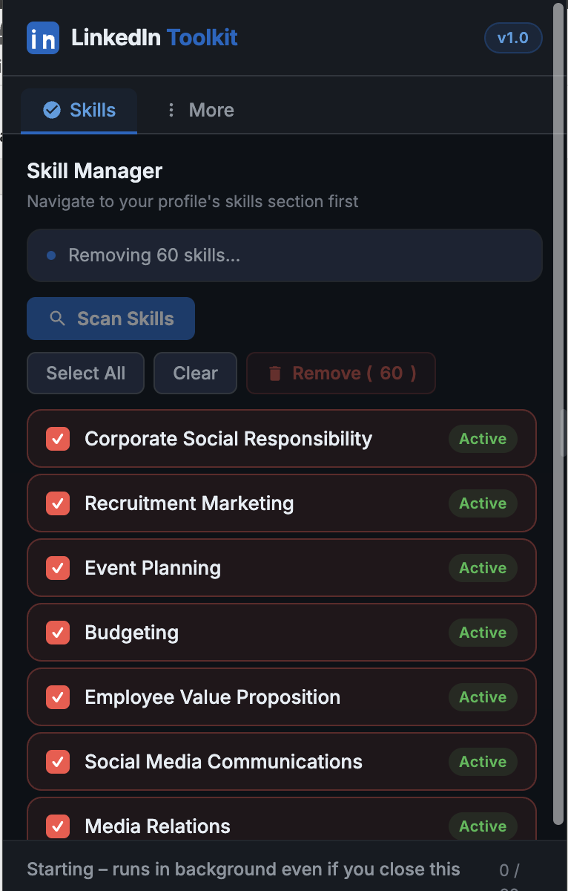

# LinkedIn Toolkit — Chrome Extension

> **Supercharge your LinkedIn profile management.** Bulk-remove skills, with more features coming soon.


---


## 📸 Preview

<table>
<tr>
<td width="40%" align="center">



</td>
<td width="60%" valign="top">

### 🧹 Skill Manager — v1.0

**Bulk-remove LinkedIn skills in seconds.**

✅ &nbsp;**Auto-scroll scan** — triggers lazy-loaded skills automatically before scanning

✅ &nbsp;**Bulk select** — select all or cherry-pick individual skills

✅ &nbsp;**Background deletion** — closing the popup doesn't stop the process

✅ &nbsp;**Live progress bar** — real-time log per skill with removed / failed status

✅ &nbsp;**Resume on reopen** — popup re-syncs with the running background job

✅ &nbsp;**Cancel anytime** — stop mid-run with one click

---

> ⚡ Deletion runs in the Chrome **service worker** — safely close the popup at any time and it keeps going.

</td>
</tr>
</table>

---

## 🛠 Installation

### Option A — Load Unpacked (Developer Mode)

1. Clone or download this repository:
   ```bash
   git clone https://github.com/shingareom/linkedin-toolkit.git
   ```
2. Open Chrome and navigate to `chrome://extensions`
3. Enable **Developer mode** (top-right toggle)
4. Click **"Load unpacked"**
5. Select the `linkedin-toolkit` folder
6. The extension icon appears in your Chrome toolbar 🎉

### Option B — Chrome Web Store *(coming soon)*

---

## 📖 Usage

### Remove LinkedIn Skills

1. **Navigate** to your LinkedIn profile's Skills section:  
   `https://www.linkedin.com/in/<your-username>/details/skills/`

2. **Click** the LinkedIn Toolkit icon in the Chrome toolbar

3. **Click "Scan Skills"** — the extension will auto-scroll to load all skills, then list them

4. **Select** the skills you want to remove (or click "Select All")

5. **Click "Remove (N)"** — deletion runs in the background; you can safely close the popup

6. **Reopen** the popup anytime to check progress

> ⚠️ LinkedIn may apply rate limits if you remove many skills rapidly. The extension adds delays between deletions to minimize this risk.

---

## 🏗 Project Structure

```
linkedin-toolkit/
├── manifest.json       # Chrome Extension Manifest V3
├── background.js       # Service worker – owns deletion loop
├── content.js          # Injected into LinkedIn pages
├── content.css         # Minimal content styles
├── popup.html          # Extension popup UI
├── popup.css           # Dark-mode popup styles
├── popup.js            # Popup logic & background communication
└── icons/
    ├── icon16.png      # Toolbar icon
    ├── icon48.png      # Extensions page icon
    ├── icon128.png     # Chrome Web Store icon
    └── icon512.png     # High-res store asset
```

---

## 🔐 Permissions

| Permission | Why it's needed |
|---|---|
| `activeTab` | Read the current LinkedIn tab to scan skills |
| `scripting` | Inject scan/delete functions into the LinkedIn page |
| `storage` | Persist deletion progress when popup is closed |
| `tabs` | Verify the target tab still exists before each deletion |
| `https://www.linkedin.com/*` | Host permission to operate on LinkedIn pages only |

No data is ever sent to external servers. Everything runs locally in your browser.

---

## ⚙️ How It Works

### Lazy-load Detection
LinkedIn renders skills in a virtual list — only visible ones exist in the DOM. The extension injects `autoScrollPage()` which incrementally scrolls the page, monitors the edit-link count, and stops once the count has been stable for 2 scroll passes.

### Background Deletion
The deletion loop lives in `background.js` (the MV3 service worker). The popup merely starts the job via `chrome.runtime.sendMessage` and listens for `deletionProgress` broadcasts. This means:
- Closing the popup **does not stop** the deletion
- Reopening the popup **restores** the live state from `chrome.storage.local`

### DOM Re-query Strategy
After each successful deletion, LinkedIn re-renders the skills list, invalidating cached `href` values. The extension re-queries `a[aria-label="Edit X skill"]` **fresh on every iteration** rather than reusing stale references.

---

## 🤝 Contributing

Pull requests are welcome! For major changes, please open an issue first to discuss what you'd like to change.

```bash
git clone https://github.com/shingareom/linkedin-toolkit.git
cd linkedin-toolkit
# Load unpacked in chrome://extensions and start hacking
```

---

## 📄 License

[MIT](./LICENSE) © 2026 Om Shingare

---

## ⚠️ Disclaimer

This extension automates interactions with the LinkedIn website. Use responsibly and in accordance with [LinkedIn's User Agreement](https://www.linkedin.com/legal/user-agreement). The author is not responsible for any account restrictions resulting from excessive automated activity.
